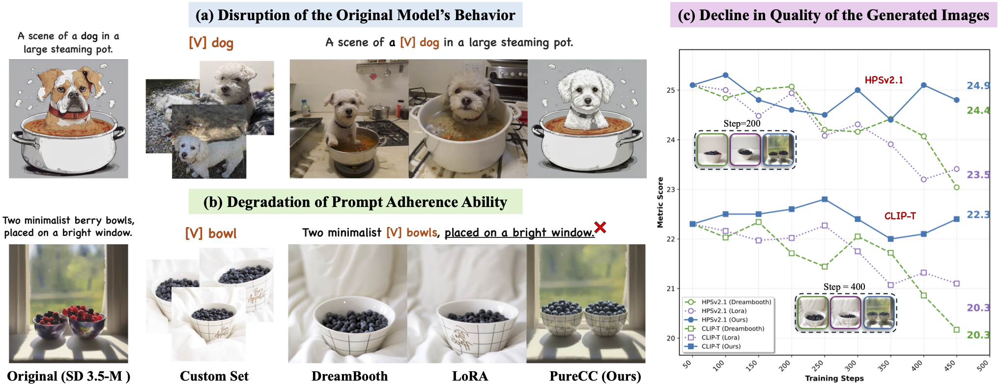
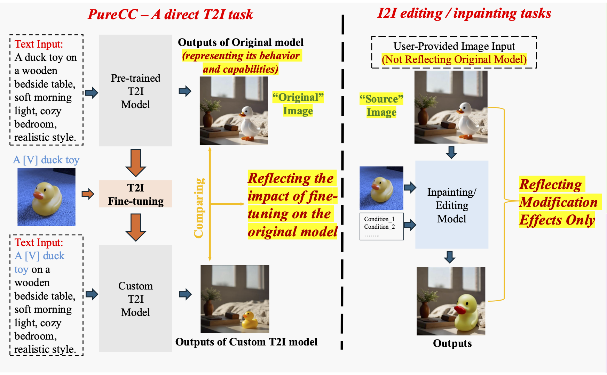
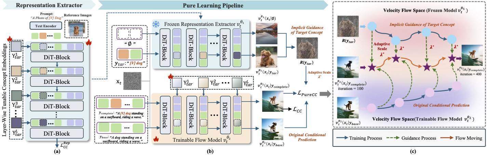
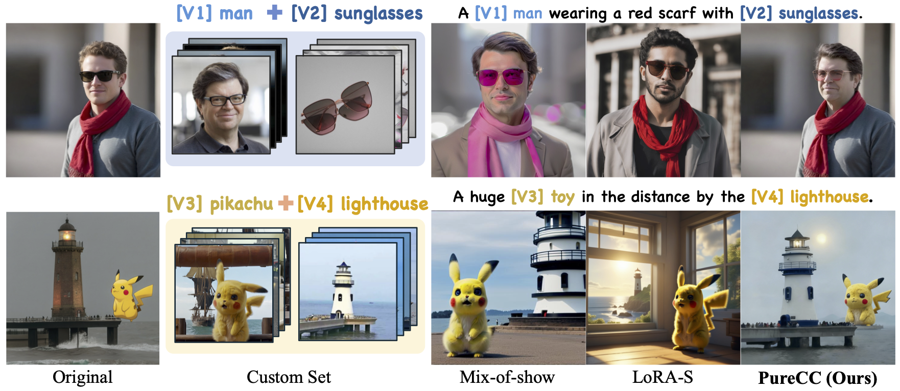
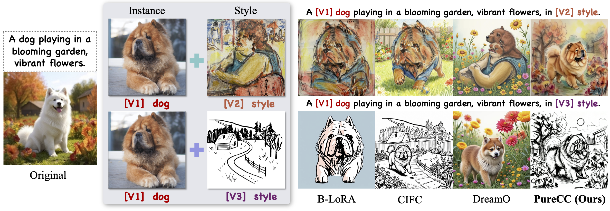

<div align="center">

# [CVPR 2026] PureCC: Pure Learning for Text-to-Image Concept Customization

**[Zhichao Liao](https://lzc-sg.github.io/)**\*‡, **[Xiaole Xian](https://github.com/connorxian/)**\*‡, Qingyu Li, Wenyu Qin, Meng Wang, **[Weicheng Xie](https://wcxie.github.io/Weicheng-Xie/)** ✉️, Siyang Song, Pingfa Feng, **[Long Zeng](https://jackyzengl.github.io/)** ✉️, [Liang Pan](https://ethan7899.github.io/)  

*Tsinghua University · Shenzhen University  
Kling Team, Kuaishou Technology · University of Exeter · S-lab, Nanyang Technological University*

\* Equal contribution, ✉️ Corresponding author  
‡ Work conducted during an internship at Kling Team, Kuaishou Technology

[](https://arxiv.org/abs/2603.07561)
[](https://github.com/lzc-sg/PureCC)
<!-- [](./LICENSE)
[](https://your-project-page.github.io/) -->

</div>


##  🔥 News

- [x] **`2026/03/27`**: 🔥 We have released the training and inference code on GitHub. Feel free to try it out!
- [x] **`2026/03/08`**: 🔥 We released the technical report on [arXiv](https://arxiv.org/abs/2603.07561).
- [x] **`2026/02/21`**: 🔥 PureCC was accepted by CVPR 2026.


## 🌏 Open Source
Thank you all for your attention! We are actively cleaning our technical report, models, and codes, and we will open source them soon.
- [x] Technical Paper on [arXiv](https://arxiv.org/abs/2603.07561)
- [x] Training and Inference code on GitHub


## ✨ Highlight

### 🚀 Teaser

<p align="center">

</p>

**PureCC enables high-fidelity personalized concept customization while better preserving the original model behavior and generation capability.**

### 💥 Motivation

<p align="center">

</p>

🔥🔥🔥 ***The goal of an I2I editing or inpainting task*** is to perform a one-time visual modification on a given image, with the ***focus on transforming that specific image into the desired result***. In contrast, ***PureCC*** aims to ***teach the model a new concept***. Moreover, compared with other concept customization methods, it not only emphasizes concept fidelity, but also highlights ***“pure learning”*** — learning only the target concept itself while ***minimizing disruption to the original model’s behavior, distribution, and capabilities***.

## 📕 Code

### Checkpoint Preparation

#### Stable Diffusion 3.5 Medium

This base model is from [Stable Diffusion 3.5 Medium](https://huggingface.co/stabilityai/stable-diffusion-3.5-medium).

> **Note:** The model is gated. You must accept the [Stability AI Community License](https://huggingface.co/stabilityai/stable-diffusion-3.5-medium) before downloading.

Download the model:
```
from huggingface_hub import snapshot_download

snapshot_download(
    repo_id="stabilityai/stable-diffusion-3.5-medium",
    local_dir="/path/to/SD3.5-medium",
)
```
Or via CLI:
```
huggingface-cli download stabilityai/stable-diffusion-3.5-medium \
    --local-dir /path/to/SD3.5-medium
```

### Inference
Our inference code is similar to that of regular LoRA SD inference.

#### Quick Start
```
import os
import torch
from diffusers import StableDiffusion3Pipeline

MODEL_PATH       = "/path/to/sd3.5-medium"
STAGE1_DIR       = "/path/to/stage1_output"       # contains learned_embeds.pt
LORA_CHECKPOINT  = "/path/to/checkpoint-1000"     # e.g. "/path/to/checkpoint-1000", or None

def inject_concept_token(pipeline, stage1_dir):
    """Register stage1 learned token into CLIP-L and CLIP-G (T5 skipped)."""
    saved = torch.load(os.path.join(stage1_dir, "learned_embeds.pt"), map_location="cpu")
    token = saved["new_concept_token"]
    print(f"concept token: '{token}'  (init from: '{saved.get('initializer_token', '?')}')")

    for tokenizer, text_encoder, embed_key in [
        (pipeline.tokenizer,   pipeline.text_encoder,   "embedding_one"),  # CLIP-L
        (pipeline.tokenizer_2, pipeline.text_encoder_2, "embedding_two"),  # CLIP-G
    ]:
        tokenizer.add_tokens([token])
        token_id = tokenizer.convert_tokens_to_ids(token)
        text_encoder.resize_token_embeddings(len(tokenizer))
        with torch.no_grad():
            text_encoder.get_input_embeddings().weight[token_id] = \
                saved[embed_key].to(dtype=text_encoder.dtype, device=text_encoder.device)

    return token

pipeline = StableDiffusion3Pipeline.from_pretrained(MODEL_PATH, torch_dtype=torch.bfloat16)
pipeline = pipeline.to("cuda")
concept_token = inject_concept_token(pipeline, STAGE1_DIR) 
pipeline.load_lora_weights(LORA_CHECKPOINT)

# ---- generate ------------------------------------------------------------- #
prompt = "a photo of a [v] dog in the park".replace("[v]", concept_token)

images = pipeline(
    prompt=[prompt],
    guidance_scale=4.0,
    generator=torch.Generator("cuda").manual_seed(42),
).images

images[0].save("image.png")
```

### Training

#### Step 1: Representation Extractor — LoRA Training

In the first stage, we train a LoRA on the target concept to build a specific representation extractor.

First, install the required dependencies:
```
git clone https://github.com/huggingface/diffusers
cd diffusers
pip install -e .
pip install -r examples/dreambooth/requirements_sd3.txt
```

Then launch Stage 1 training:

```bash
export MODEL_NAME="/path/to/SD3.5-medium"
export DATA_PATH="/path/to/dataset"
export OUTPUT_DIR="./output/base_ckpt"

accelerate launch train_stage1_sd3.py \
  --pretrained_model_name_or_path=$MODEL_NAME \
  --data_path=$DATA_PATH \
  --csv_name=robot_toy.csv \
  --output_dir=$OUTPUT_DIR \
  --new_concept_token="<new1>" \
  --embedding_lr=5e-3 \
  --learning_rate=1e-4 \
  --rank=4 \
  --resolution=512 \
  --train_batch_size=4 \
  --max_train_steps=400 \
  --mixed_precision=bf16 \
  --seed=0
```
The word of the layer-wise embedding is initialized with a similar word in semantics.

#### Step 2: Pure Learning — PureCC Training
In the second stage, we introduce a PureCC loss to prevent disruption to the original model’s behavior and capabilities.

```
accelerate launch train_stage2_sd3.py \
  --pretrained_model_name_or_path /path/to/SD3.5-medium \
  --data_path /path/to/dataset \
  --csv_name robot_toy.csv \
  --output_dir ./output \
  --max_train_steps 800 \
  --learning_rate 1e-4 \
  --rank 4 \
  --eta 2.0 \
  --mixed_precision bf16
```

### 🥥 Pipeline

<p align="center">

</p>

## 💖 Results

## Concept Customization

<p align="center">

</p>

## Multi-Concept Customization

<p align="center">

</p>

## Instance + Style Customization

<p align="center">

</p>

## 🖊 Citation
If you find PureCC useful for your research, welcome to 🌟 this repo and cite our work using the following BibTeX:

```bibtex
@misc{liao2026purecc,
      title={PureCC: Pure Learning for Text-to-Image Concept Customization}, 
      author={Zhichao Liao and Xiaole Xian and Qingyu Li and Wenyu Qin and Meng Wang and Weicheng Xie and Siyang Song and Pingfa Feng and Long Zeng and Liang Pan},
      year={2026},
      eprint={2603.07561},
      archivePrefix={arXiv},
      primaryClass={cs.CV},
      url={https://arxiv.org/abs/2603.07561}, 
}
```
## 🔗 Related Work (Pure Learning)
- [PuLID: Pure and Lightning ID Customization via Contrastive Alignment](https://github.com/ToTheBeginning/PuLID)
- [SPF-Portrait: Towards Pure Portrait Customization with Semantic Pollution-Free Fine-tuning](https://github.com/KlingAIResearch/SPF-Portrait)
